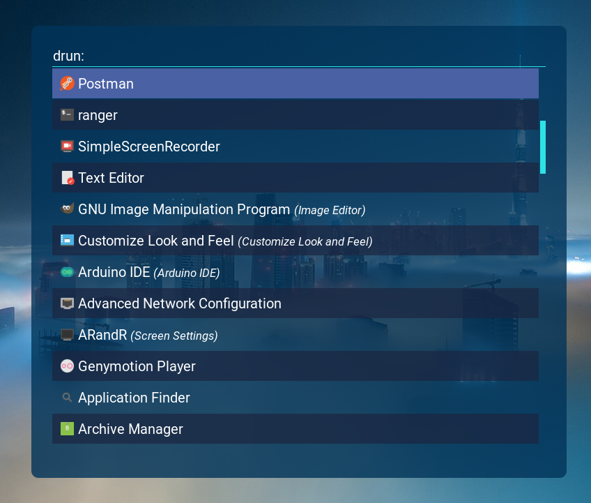

[](https://opensource.org/licenses/MIT)
[](https://shields.io/)

# Nebula theme for rofi



## Installation:

**You need to have <a href="https://github.com/davatorium/rofi">rofi</a> installed!**

```sh
  git clone https://github.com/DKSadx/Nebula-rofi-theme.git
  cp Nebula-rofi-theme/Nebula.rasi /usr/share/rofi/themes/
```

## Using rofi with Nebula theme:

Launch rofi with this command:

```sh
  rofi -show drun -theme Nebula -show-icons
```
